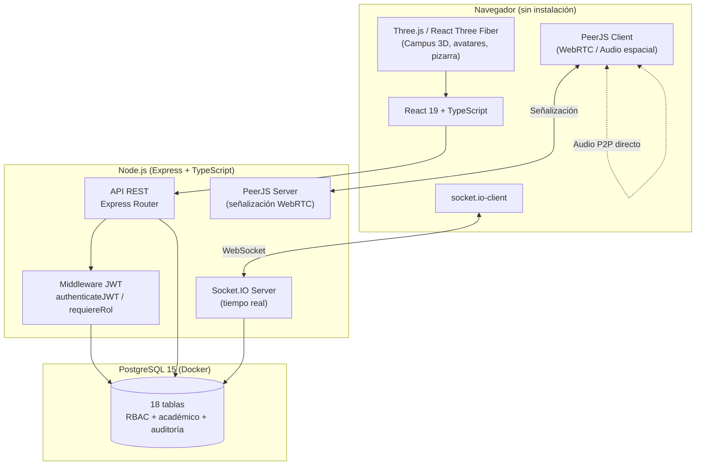
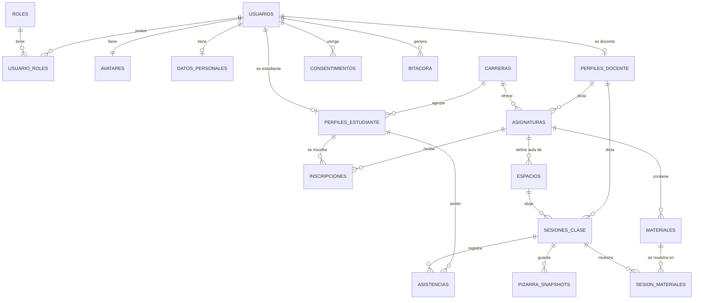

# Propuesta de Ingeniería de Software
## Metaverso Educativo UPDS — Plataforma de Clases Virtuales 3D

**Institución:** Universidad Privada Domingo Savio (UPDS) — Facultad de Ingeniería
**Materia piloto:** Ingeniería de Software
**Versión del documento:** 1.0
**Estado del sistema:** Prototipo funcional en desarrollo activo (piloto local)

---

## Índice

1. [Resumen Ejecutivo](#1-resumen-ejecutivo)
2. [Antecedentes y Planteamiento del Problema](#2-antecedentes-y-planteamiento-del-problema)
3. [Objetivos](#3-objetivos)
4. [Justificación](#4-justificación)
5. [Alcance y Limitaciones](#5-alcance-y-limitaciones)
6. [Metodología de Desarrollo](#6-metodología-de-desarrollo)
7. [Actores del Sistema](#7-actores-del-sistema)
8. [Requerimientos Funcionales (RF)](#8-requerimientos-funcionales-rf)
9. [Requerimientos No Funcionales (RNF)](#9-requerimientos-no-funcionales-rnf)
10. [Arquitectura del Sistema](#10-arquitectura-del-sistema)
11. [Modelo de Datos](#11-modelo-de-datos)
12. [Modelo de Roles y Permisos (RBAC)](#12-modelo-de-roles-y-permisos-rbac)
13. [Casos de Uso](#13-casos-de-uso)
14. [Especificación de la API REST](#14-especificación-de-la-api-rest)
15. [Comunicación en Tiempo Real (WebSockets)](#15-comunicación-en-tiempo-real-websockets)
16. [Seguridad](#16-seguridad)
17. [Diseño de la Interfaz y Experiencia de Usuario](#17-diseño-de-la-interfaz-y-experiencia-de-usuario)
18. [Estrategia de Pruebas y Verificación](#18-estrategia-de-pruebas-y-verificación)
19. [Riesgos y Mitigaciones](#19-riesgos-y-mitigaciones)
20. [Plan de Trabajo Realizado](#20-plan-de-trabajo-realizado)
21. [Trabajo Futuro](#21-trabajo-futuro)
22. [Conclusiones](#22-conclusiones)
23. [Anexos](#23-anexos)

---

## 1. Resumen Ejecutivo

**Metaverso UPDS** es una plataforma web de clases virtuales que reemplaza la videollamada tradicional por un **campus universitario en 3D navegable en tiempo real**, accesible directamente desde el navegador sin instalar software. Cada estudiante y docente controla un avatar personalizable, se desplaza por un campus central y entra a aulas virtuales específicas de su asignatura, donde puede comunicarse por voz espacial, dibujar en una pizarra colaborativa y registrar su asistencia de forma automática.

El sistema implementa un modelo de **control de acceso basado en roles (RBAC)** con cuatro roles (administrador, docente, estudiante, invitado), un **panel administrativo con control total** sobre usuarios, carreras, asignaturas y espacios, un **dashboard con estadísticas y alertas calculadas en vivo**, y un **ciclo de vida completo de clases** (programar → iniciar → finalizar) que cierra automáticamente los registros de asistencia.

El stack es **React 19 + Three.js (React Three Fiber) + TypeScript** en el frontend, **Node.js + Express + Socket.IO** en el backend, y **PostgreSQL 15** como motor relacional, todo containerizado con Docker para la base de datos.

---

## 2. Antecedentes y Planteamiento del Problema

Las clases virtuales basadas únicamente en videollamada (Zoom, Meet, Teams) presentan limitaciones reconocidas en la literatura de educación a distancia:

- **Fatiga por videollamada** ("Zoom fatigue"): la exposición prolongada a una cuadrícula de rostros reduce la sensación de presencia y aumenta el cansancio cognitivo.
- **Falta de espacio social**: no existe un lugar informal de encuentro entre clases, a diferencia de un campus físico.
- **Pasividad del estudiante**: la interacción se reduce a "cámara encendida/apagada" y chat de texto, sin un cuerpo o presencia espacial que fomente participación.
- **Control de asistencia manual**: los docentes dependen de listas o de que el estudiante "levante la mano" digitalmente, lo que es fácil de falsear.

**Problema central:** la UPDS carece de una plataforma propia que ofrezca una experiencia de clase virtual con sensación de presencia física, control de acceso académico real (solo quien está inscrito entra al aula) y trazabilidad de asistencia automática y auditable, sin depender de herramientas de terceros con licenciamiento externo.

---

## 3. Objetivos

### 3.1 Objetivo General

Diseñar e implementar una plataforma web de metaverso educativo 3D que permita a estudiantes y docentes de la UPDS interactuar en un campus virtual persistente, con control de acceso basado en roles, comunicación en tiempo real y registro automático de asistencia, operable enteramente desde el navegador.

### 3.2 Objetivos Específicos

1. Implementar autenticación y autorización basada en roles (administrador, docente, estudiante, invitado) con contraseñas cifradas y bloqueo temporal ante intentos fallidos.
2. Modelar un campus 3D navegable con un espacio público (Campus Central) y aulas virtuales privadas, generadas dinámicamente a partir de las asignaturas registradas en base de datos.
3. Permitir la personalización visual del avatar (género, color, vestimenta, accesorios) en 3D con vista previa rotable.
4. Implementar comunicación por voz en tiempo real con atenuación espacial (audio 3D) mediante WebRTC.
5. Proveer una pizarra digital colaborativa donde docentes y estudiantes puedan escribir según permisos diferenciados por rol, con persistencia de snapshots.
6. Automatizar el registro de asistencia al ingresar a un aula con clase en curso, calculando el estado (presente/tarde) según un umbral de tolerancia configurable, y cerrando el registro (hora de salida) al finalizar la clase o desconectarse.
7. Dar al docente control sobre el ciclo de vida completo de sus clases: crear/asignar curso, iniciar sesión, generar reportes de asistencia y finalizar la clase.
8. Dar al administrador control total del sistema: gestión CRUD de usuarios, carreras, asignaturas y espacios, además de un dashboard con estadísticas académicas y alertas de integridad calculadas en vivo.
9. Garantizar que toda regla de autorización (quién puede dibujar, borrar, finalizar una clase, ver un reporte) se valide en el servidor y no solo se oculte en la interfaz.
10. Registrar en una bitácora auditable los eventos de seguridad y de negocio relevantes (logins, fallos, creación/edición/eliminación de entidades, inicio/fin de clase).

---

## 4. Justificación

- **Pedagógica:** un entorno espacial con presencia (avatar, proximidad, voz posicional) favorece la sensación de "estar en clase" frente a una grilla de videollamada, y es especialmente relevante para una carrera de Ingeniería de Software donde los propios estudiantes son usuarios finales críticos del producto.
- **Institucional:** una plataforma propia evita costos de licenciamiento de terceros y permite a la UPDS controlar sus propios datos académicos y de asistencia.
- **Técnica:** el stack elegido (React + Three.js + Node + PostgreSQL) es de código abierto, ampliamente documentado, ejecutable en el navegador sin plugins y escalable horizontalmente.
- **Académica:** el proyecto sirve como caso de estudio real de ingeniería de software: requiere RBAC, tiempo real, persistencia relacional normalizada, y disciplina de auditoría de seguridad — cubriendo de forma concreta las competencias de la materia piloto (Ingeniería de Software).

---

## 5. Alcance y Limitaciones

### 5.1 Alcance actual (implementado y verificado)

- Autenticación con 4 roles, registro de estudiante/docente, acceso de invitado sin registro.
- Campus 3D con edificios dinámicos (uno por aula real en base de datos, sin límite fijo) y dos edificios de servicio (sala de descanso, sala de decanos).
- Aulas virtuales con mobiliario 3D, pizarra digital colaborativa y postura de "sentado" interactiva.
- VoIP espacial vía WebRTC (PeerJS) con atenuación por distancia.
- Registro automático de asistencia, con cierre de asistencias abiertas al finalizar la clase.
- Ciclo de vida completo de clase: crear curso/iniciar clase, ver reporte de asistencia en vivo, finalizar clase.
- Flujo de solicitud de acceso a aula en tiempo real (estudiante pide ingreso, docente aprueba/rechaza) y acceso directo por código de aula.
- Panel de administración con CRUD completo de usuarios, espacios, carreras, asignaturas y consulta de docentes.
- Dashboard administrativo con estadísticas (usuarios por rol, ocupación de espacios, indicadores académicos, actividad de 7 días) y alertas de capacidad/integridad/informativas calculadas al vuelo.
- Bitácora de auditoría consultable por el administrador.
- Personalización de avatar 3D rotable (OrbitControls) con accesorios.
- Modo claro/oscuro persistente y enrutamiento por hash (URLs navegables: `/`, `/login`, `/espacios`, `/metaverso`, `/admin`, `/docente`).

### 5.2 Limitaciones actuales (fuera de alcance de esta versión)

- **Compartir/proyectar archivos PPT/PDF dentro del aula:** el modelo de datos ya contempla `materiales` y `sesion_materiales`, pero no existe todavía un endpoint ni UI de carga/proyección de archivos.
- **Inscripción granular de estudiantes por asignatura:** el auto-registro inscribe automáticamente al nuevo estudiante en *todas* las asignaturas activas (mecanismo heredado de la fase de piloto de una sola materia); falta una gestión de inscripciones por carrera/semestre desde el panel administrativo.
- **Autenticación de la capa de tiempo real:** los eventos de Socket.IO confían en el `userId` que el cliente declara al unirse a un espacio; no hay verificación JWT a nivel de socket (sí existe autorización por rol consultada contra la base de datos en el servidor para acciones sensibles como la pizarra).
- **Recuperación de contraseña:** no implementada (mencionada como caso de uso en el análisis, pendiente de implementación).
- **Métricas de disponibilidad y despliegue productivo:** el sistema corre en modo desarrollo local (`tsx watch` / `vite dev`); no hay todavía pipeline de CI/CD ni entorno de producción desplegado.

---

## 6. Metodología de Desarrollo

El desarrollo siguió un enfoque **iterativo e incremental**, con ramas de feature independientes integradas a `main` mediante *pull requests*, y un patrón recurrente de:

1. **Revisión dirigida por el usuario/product owner** ("revisa X módulo") sobre una funcionalidad ya construida.
2. **Auditoría de código y datos en vivo** (lectura de esquema real, endpoints, y pruebas contra la base de datos corriendo) en lugar de asumir el comportamiento por la documentación.
3. **Corrección de raíz** de los defectos encontrados (no parches superficiales), incluyendo lo que aparece en el camino aunque no fuera el pedido original.
4. **Verificación explícita** antes de dar cualquier trabajo por terminado: chequeo de tipos (`tsc --noEmit`), *linting* (`oxlint`), y pruebas funcionales en vivo (peticiones HTTP reales, clientes de Socket.IO reales, y en casos de UI, automatización de navegador).

Este ciclo se aplicó, entre otras, a las siguientes iteraciones documentadas:

| Iteración | Resultado |
|---|---|
| Auditoría de roles y accesos | Corrección del bug crítico "administrador ve la vista de estudiante"; 3 hallazgos de seguridad en middleware (auto-registro como admin, fuga de sesiones entre asignaturas, secreto JWT con *fallback* débil) |
| Dashboard administrativo | Reemplazo de un panel 100% simulado por estadísticas y alertas reales calculadas contra PostgreSQL |
| Ciclo de vida de clases/asistencia | Corrección de 5 defectos: reporte de asistencia roto, falta de endpoint para finalizar clase, asistencia sin verificar inscripción, selección de sesión activa incorrecta, reporte bloqueado para el administrador |
| Campus dinámico | Reemplazo de 2 aulas fijas ("Aula 101/102") por una grilla generada desde la tabla `espacios` real |
| Reconciliación de ramas | *Merge* de la rama de auditoría/RBAC con el trabajo paralelo de UI (ruteo, personalización de avatar, postura sentado), resolviendo conflictos reales de lógica de negocio duplicada |
| Pizarra colaborativa | Corrección de permisos: antes solo el docente podía escribir (y sin validación real en servidor); ahora estudiante y docente/admin dibujan, con borrado/guardado restringido a docente/admin y validado en el backend |

---

## 7. Actores del Sistema

| Actor | Descripción | Autenticación |
|---|---|---|
| **Administrador** | Control total del sistema: usuarios, carreras, asignaturas, espacios, bitácora y dashboard. | Cuenta registrada, rol `administrador` |
| **Docente** | Dicta clases: crea/asigna cursos, inicia y finaliza sesiones, consulta reportes de asistencia, escribe y administra la pizarra. | Cuenta registrada, rol `docente` |
| **Estudiante** | Asiste a clases: explora el campus, entra a sus aulas inscritas, registra asistencia automáticamente, participa en la pizarra colaborativa y en el chat/voz. | Cuenta registrada, rol `estudiante` |
| **Invitado** | Acceso de solo lectura al Campus Central, sin necesidad de registro (botón "Ingreso como Invitado"). No accede a aulas. | Token temporal emitido sin credenciales, rol `invitado` |

Un usuario puede tener más de un rol simultáneamente (modelo N:M vía `usuario_roles`), aunque en los datos semilla cada cuenta tiene uno solo.

---

## 8. Requerimientos Funcionales (RF)

> Se preserva la numeración original (RF-01 a RF-08) usada en el código y la base de datos, y se agrega la numeración RF-09 en adelante para las capacidades incorporadas posteriormente (panel administrativo, ciclo de vida de clases, solicitud de acceso, etc.).

| Código | Requerimiento | Estado |
|---|---|---|
| **RF-01** | El sistema debe permitir la creación de avatares 3D personalizables (género, color de piel/ropa, cabello, accesorios), con vista previa rotable en 3D antes de confirmar. | ✅ Implementado |
| **RF-02** | El sistema debe contar con un "Campus Central" (zona de encuentro público) y "Aulas Virtuales" (una por cada asignatura/espacio real registrado, generadas dinámicamente — no un número fijo). | ✅ Implementado |
| **RF-03** | El sistema debe soportar comunicación por voz en tiempo real (VoIP) con efecto espacial (se oye más fuerte a quien está cerca), con opción de silenciar el propio micrófono. | ✅ Implementado |
| **RF-04** | El sistema debe permitir una pizarra digital colaborativa dentro del aula, con trazos sincronizados en vivo para todos los presentes y persistencia de instantáneas en base de datos. | ✅ Implementado (colaborativa: ver RF-16) |
| **RF-05** | El sistema debe registrar la asistencia automáticamente al ingresar a un aula con clase en curso, determinando el estado "presente" o "tarde" según un umbral de tolerancia, y cerrar la asistencia (hora de salida) al desconectarse o al finalizar la clase. | ✅ Implementado |
| **RF-06** | El sistema debe permitir registrarse e iniciar sesión, con roles diferenciados (estudiante, docente, administrador) y acceso de invitado sin registro. | ✅ Implementado |
| **RF-07** | El sistema debe permitir mover el avatar con el teclado (WASD/flechas) y ver en tiempo real a los demás usuarios conectados en el mismo espacio, incluyendo su postura (de pie/sentado). | ✅ Implementado |
| **RF-08** | El docente debe poder programar/iniciar sesiones de clase y consultar el reporte de asistencia de su asignatura (inscritos, presentes, tarde, ausentes). | ✅ Implementado |
| **RF-09** | El administrador debe tener control CRUD completo sobre usuarios (crear, editar, resetear contraseña, activar/desactivar, eliminar, asignar roles), carreras, asignaturas y espacios. | ✅ Implementado |
| **RF-10** | El sistema debe proveer al administrador un dashboard con estadísticas (usuarios por rol, ocupación de espacios, indicadores académicos, actividad de los últimos 7 días) y alertas de capacidad, integridad de datos e informativas, calculadas en vivo contra la base de datos. | ✅ Implementado |
| **RF-11** | El docente debe poder finalizar explícitamente una clase en curso; al finalizar, el sistema debe cerrar automáticamente las asistencias abiertas de los estudiantes presentes. El administrador también puede finalizar cualquier clase. | ✅ Implementado |
| **RF-12** | El sistema debe permitir que un estudiante solicite acceso a un aula con clase en curso y que el docente apruebe o rechace la solicitud en tiempo real; alternativamente, el estudiante puede ingresar directamente con el código de la asignatura. | ✅ Implementado |
| **RF-13** | El sistema debe permitir el ingreso como invitado (sin registro) con acceso restringido únicamente al Campus Central. | ✅ Implementado |
| **RF-14** | El sistema debe permitir personalizar el avatar en una vista 3D rotable (control orbital de cámara) con accesorios visuales (sombrero, gafas, mochila). | ✅ Implementado |
| **RF-15** | El sistema debe permitir que el avatar adopte una postura de "sentado" al interactuar con mobiliario (pupitres, sofás, escritorio) mediante la tecla `E`, visible también para los demás usuarios del espacio. | ✅ Implementado |
| **RF-16** | La pizarra digital debe permitir escritura colaborativa: docentes, estudiantes y administradores pueden dibujar trazos; solo docentes y administradores pueden borrar el pizarrón completo o persistir una instantánea oficial en base de datos. | ✅ Implementado |
| **RF-17** | El sistema debe permitir compartir materiales de clase (PDF/PPT) asociados a una asignatura y visualizarlos dentro de una sesión. | ⏳ Modelo de datos listo (`materiales`, `sesion_materiales`); endpoint y UI pendientes |
| **RF-18** | El sistema debe permitir recuperar el acceso a la cuenta ante contraseña olvidada. | ⏳ Pendiente |

---

## 9. Requerimientos No Funcionales (RNF)

| Código | Requerimiento | Cómo se verifica / se implementó |
|---|---|---|
| **RNF-01** (Rendimiento de audio) | La latencia de audio no debe superar los 150 ms para garantizar fluidez en la conversación. | Medición extremo a extremo vía WebRTC/PeerJS ≤ 150 ms |
| **RNF-02** (Usabilidad) | La interfaz debe ser intuitiva para usuarios sin experiencia en videojuegos; guía de teclas visible en pantalla. | Un usuario nuevo llega a su aula en < 3 min sin ayuda externa |
| **RNF-03** (Protección de datos) | El sistema debe registrar el consentimiento explícito del usuario (tratamiento de datos, uso de voz, grabación de clase) y almacenar solo datos personales mínimos necesarios. | Tabla `consentimientos` versionada; formulario de registro con aceptación de términos |
| **RNF-04** (Disponibilidad) | El servicio debe mantener disponibilidad durante el horario lectivo. | Objetivo ≥ 99.9% Uptime (pendiente de medición en entorno productivo) |
| **RNF-05** (Seguridad) | Las contraseñas deben almacenarse con hash (bcrypt), el acceso a las aulas debe validarse según rol e inscripción real en base de datos, las cuentas deben bloquearse temporalmente tras intentos fallidos repetidos, y toda comunicación en producción debe ir cifrada (HTTPS/WSS). | bcrypt costo 10; bloqueo 15 min tras 5 intentos fallidos; filtro de aulas por `inscripciones`/`perfiles_docente` en el servidor; bitácora auditable |
| **RNF-06** (Rendimiento/Portabilidad) | La aplicación debe cargar rápidamente, mantener una tasa de cuadros aceptable en equipos de gama media y funcionar sin instalación en navegadores modernos (Chrome, Edge, Firefox). | Vite con *code-splitting*; WebGL vía Three.js; sin plugins nativos |
| **RNF-07** (Autorización en el servidor) | Toda acción sensible (dibujar/borrar/guardar en la pizarra, finalizar una clase, ver reportes, administrar entidades) debe validarse contra los roles reales del usuario en la base de datos del lado del servidor, nunca confiando únicamente en que la interfaz oculte el botón correspondiente. | Middleware `requiereAdmin`/`requiereRol`; verificación de rol en `socketHandler.ts` antes de reenviar eventos de pizarra; pruebas automatizadas con cliente de Socket.IO real confirmando el rechazo server-side |
| **RNF-08** (Auditoría) | El sistema debe registrar en una bitácora los eventos relevantes de seguridad (login exitoso/fallido, bloqueo) y de negocio (creación/edición/eliminación de usuarios y entidades académicas, inicio/fin de clase, consulta de reportes), con IP y marca de tiempo. | Tabla `bitacora`, función `bitacora()` invocada en cada endpoint sensible; panel `GET /api/admin/bitacora` con filtros |
| **RNF-09** (Consistencia de datos en tiempo real) | El estado "sesión activa" de un aula (qué clase está en curso) debe reflejar siempre la sesión vigente más reciente, incluso si existen sesiones antiguas sin cerrar explícitamente. | Consulta `LATERAL` con orden `(estado = 'en_curso') DESC, COALESCE(inicio_real, inicio_programado) DESC` en `GET /api/espacios` |

---

## 10. Arquitectura del Sistema

### 10.1 Vista general



### 10.2 Stack tecnológico

**Frontend**

| Tecnología | Versión | Uso |
|---|---|---|
| React | 19.2.7 | Framework de UI |
| TypeScript | ~6.0.2 | Tipado estático |
| Vite | ^8.1.1 | *Build tool* / servidor de desarrollo |
| Three.js | ^0.185.1 | Motor de renderizado 3D (WebGL) |
| @react-three/fiber | ^9.6.1 | Enlace declarativo React ↔ Three.js |
| @react-three/drei | ^10.7.7 | Utilidades 3D (controles de cámara, helpers) |
| socket.io-client | ^4.8.3 | Cliente de tiempo real |
| peerjs | ^1.5.5 | Cliente de señalización WebRTC (VoIP) |
| oxlint | ^1.71.0 | *Linter* |

**Backend**

| Tecnología | Versión | Uso |
|---|---|---|
| Node.js + Express | ^4.21.2 | Servidor HTTP y API REST |
| TypeScript (`tsx`) | ^5.7.2 / ^4.19.2 | Tipado + ejecución en desarrollo con recarga en caliente |
| Socket.IO | ^4.8.1 | Servidor de eventos en tiempo real |
| `pg` (node-postgres) | ^8.13.1 | Driver de PostgreSQL |
| bcrypt | ^5.1.1 | Hash de contraseñas |
| jsonwebtoken | ^9.0.2 | Emisión/verificación de JWT |
| peer | ^1.0.2 | Servidor de señalización WebRTC integrado |
| dotenv | ^16.4.7 | Configuración por variables de entorno |

**Persistencia e infraestructura**

| Componente | Detalle |
|---|---|
| PostgreSQL | 15-alpine, vía `docker-compose.yml`, puerto 5432, volumen nombrado `postgres_data` |
| Esquema | `database/schema.sql`, montado como script de inicialización del contenedor |

### 10.3 Estructura de carpetas relevante

```text
├── docker-compose.yml         # PostgreSQL 15 en contenedor
├── database/schema.sql        # Esquema completo + datos semilla
├── src/                       # Frontend (React)
│   ├── App.tsx                 # Enrutamiento por hash, sockets globales, layout
│   ├── index.css               # Estilos globales (tema claro/oscuro)
│   └── components/
│       ├── mundo3d/             # Motor 3D: Campus, Edificio, AvatarModel, CameraRig,
│       │                        # Mobiliario, CustomizadorAvatar, Door, texto3d
│       ├── AdminPanel.tsx        # Panel de administración (CRUD + dashboard)
│       ├── AdminDashboardTab.tsx # Estadísticas, gráficos y alertas
│       ├── TeacherPanel.tsx      # Panel del docente ("Mis Clases")
│       ├── CrearCursoModal.tsx   # Alta de curso + inicio de clase
│       ├── SolicitudAccesoModal.tsx # Solicitud de acceso a aula en vivo
│       ├── Pizarra2D.tsx         # Pizarra colaborativa (canvas 2D superpuesto)
│       ├── MetaversoCanvas.tsx   # Lienzo 3D raíz, coordinación sockets/VoIP
│       ├── AvatarCustomizer3D.tsx / CustomAvatar.tsx # Personalización de avatar
│       ├── AudioClient.ts       # Cliente VoIP y audio espacial
│       └── Login.tsx / LandingPage.tsx
└── server/                    # Backend (Node/Express)
    └── src/
        ├── index.ts             # Rutas REST (38 endpoints), arranque de Express/Socket.IO/PeerJS
        ├── socketHandler.ts     # Eventos de tiempo real y permisos de pizarra
        ├── helpers.ts           # Lógica de registro/cierre de asistencia
        ├── db.ts                # Conexión a PostgreSQL
        └── middleware/auth.ts   # authenticateJWT, requiereRol, requiereAdmin
```

---

## 11. Modelo de Datos

### 11.1 Diagrama Entidad-Relación (resumen)



### 11.2 Catálogo de entidades (18 tablas)

| # | Tabla | Rol en el sistema | RF/RNF asociado |
|---|---|---|---|
| 1 | `roles` | Catálogo RBAC (administrador, docente, estudiante, invitado) | RF-06 |
| 2 | `usuarios` | Credenciales, estado de cuenta, bloqueo por intentos fallidos | RF-06, RNF-05 |
| 3 | `usuario_roles` | Relación N:M usuario↔rol, con auditoría de quién asignó el rol | RF-06 |
| 4 | `datos_personales` | Documento de identidad, nacionalidad, género, tipo de sangre, etc. | RNF-03 |
| 5 | `carreras` | Catálogo de carreras (sigla, título académico, sistema de enseñanza) | RF-09 |
| 6 | `perfiles_estudiante` | Registro UPDS, carrera, semestre, turno, estado académico | RF-01, RF-09 |
| 7 | `perfiles_docente` | Código docente, grado académico, especialidad, tipo de contrato | RF-08, RF-09 |
| 8 | `bitacora` | Auditoría de eventos (login, CRUD, inicio/fin de clase) con IP y fecha | RNF-08 |
| 9 | `consentimientos` | Aceptación versionada de tratamiento de datos, uso de voz, grabación | RNF-03 |
| 10 | `avatares` | Apariencia JSONB del avatar (color, ropa, accesorios) y nombre visible | RF-01, RF-14 |
| 11 | `asignaturas` | Materias, código, docente asignado, gestión académica | RF-02, RF-09 |
| 12 | `inscripciones` | Relación N:M estudiante↔asignatura; controla quién entra a qué aula | RF-02, RF-05 |
| 13 | `espacios` | Campus (público) y aulas (privadas, ligadas a una asignatura) | RF-02 |
| 14 | `sesiones_clase` | Cada clase dictada: horario, estado (`programada`/`en_curso`/`finalizada`/`cancelada`), tolerancia | RF-08, RF-11 |
| 15 | `asistencias` | Registro de ingreso/salida y estado (`presente`/`tarde`/`ausente`) por sesión | RF-05, RF-11 |
| 16 | `materiales` | Referencia a archivos PDF/PPT/imagen por asignatura | RF-17 (pendiente UI) |
| 17 | `sesion_materiales` | Qué material se mostró en qué sesión | RF-17 (pendiente UI) |
| 18 | `pizarra_snapshots` | Instantáneas vectoriales (JSONB) de trazos de pizarra, por sesión | RF-04, RF-16 |

### 11.3 Reglas de integridad destacadas

- `espacios`: restricción `CHECK` que obliga a que toda **aula** tenga una asignatura asociada, y a que el **campus** nunca la tenga.
- `sesiones_clase`: restricción `CHECK (fin_programado > inicio_programado)`; estado limitado a un enum de 4 valores válidos.
- `asistencias`: `UNIQUE (sesion_id, usuario_id)` — imposibilita duplicar el registro de un mismo estudiante en la misma clase (idempotencia).
- Claves foráneas con `ON DELETE CASCADE` en relaciones de dependencia fuerte (p. ej. eliminar una asignatura elimina sus inscripciones) y `ON DELETE RESTRICT` donde no debe perderse trazabilidad (p. ej. no se puede eliminar un docente con asignaturas activas sin antes reasignarlas).

---

## 12. Modelo de Roles y Permisos (RBAC)

### 12.1 Matriz de permisos por módulo

| Módulo / Acción | Invitado | Estudiante | Docente | Administrador |
|---|:---:|:---:|:---:|:---:|
| Ver Campus Central | ✅ | ✅ | ✅ | ✅ |
| Entrar a aulas | ❌ | ✅ (solo inscrito) | ✅ (solo propias) | ✅ (todas) |
| Personalizar avatar | ✅ | ✅ | ✅ | ✅ |
| Ver lista de espacios (`GET /api/espacios`) | Solo campus | Aulas inscritas | Aulas propias | Todas las aulas |
| Registrar asistencia | ❌ | ✅ (si inscrito) | ❌ | ❌ |
| Iniciar/crear clase | ❌ | ❌ | ✅ | ❌ |
| Finalizar clase | ❌ | ❌ | ✅ (dueño) | ✅ (cualquiera) |
| Ver reporte de asistencia | ❌ | ❌ | ✅ (dueño) | ✅ (cualquiera) |
| Dibujar en la pizarra | ❌ | ✅ | ✅ | ✅ |
| Borrar / guardar pizarra | ❌ | ❌ | ✅ | ✅ |
| Solicitar acceso a aula | ❌ | ✅ | — | — |
| Aprobar/rechazar solicitud de acceso | ❌ | ❌ | ✅ | — |
| CRUD de usuarios/carreras/asignaturas/espacios | ❌ | ❌ | ❌ | ✅ |
| Ver dashboard y bitácora | ❌ | ❌ | ❌ | ✅ |

### 12.2 Mecanismo de aplicación

- **REST:** middleware `authenticateJWT` (verifica el token) + `requiereRol(...roles)` / `requiereAdmin` (consulta los roles reales del usuario contra `usuario_roles` en cada petición, no confía en el rol embebido en el token).
- **Tiempo real (Socket.IO):** al unirse a un espacio (`join_space`), el servidor resuelve los roles del usuario contra la base de datos y los guarda en el estado de la conexión; cada evento sensible (`draw_stroke`, `clear_board`, `save_pizarra`) se valida contra ese rol antes de reenviarlo a la sala.
- **Filtrado de datos, no solo de acciones:** por ejemplo, `GET /api/espacios` no solo *permite o niega* la llamada — devuelve un conjunto de aulas distinto según el rol de quien pregunta (todas para el administrador, solo las propias para el docente, solo las inscritas para el estudiante, solo el campus para el invitado).

---

## 13. Casos de Uso

### 13.1 Diagrama general de actores

```mermaid
graph TB
    subgraph Actores
        INV["🚪 Invitado"]
        EST["🎓 Estudiante"]
        DOC["👨‍🏫 Docente"]
        ADM["👨‍💼 Administrador"]
    end

    subgraph Auth["Autenticación (RF-06, RF-13)"]
        LOGIN["Iniciar Sesión"]
        REGISTER["Registrarse"]
        GUEST["Ingresar como Invitado"]
    end

    subgraph Mundo["Campus y Aulas (RF-02, RF-07, RF-12)"]
        CAMPUS["Explorar Campus 3D"]
        MOVER["Moverse (WASD) / Sentarse [E]"]
        SOLICITAR["Solicitar Acceso a Aula"]
        ENTRAR["Entrar al Aula"]
    end

    subgraph Clase["Ciclo de Clase (RF-08, RF-11)"]
        CREAR_CURSO["Crear Curso / Iniciar Clase"]
        FINALIZAR["Finalizar Clase"]
        REPORTE["Ver Reporte de Asistencia"]
        ASISTENCIA["Registrar Asistencia Automática"]
    end

    subgraph Pizarra["Pizarra Colaborativa (RF-04, RF-16)"]
        DIBUJAR["Dibujar"]
        ADMIN_PIZARRA["Borrar / Guardar Snapshot"]
    end

    subgraph Administracion["Panel Administrativo (RF-09, RF-10)"]
        CRUD["CRUD Usuarios/Carreras/Asignaturas/Espacios"]
        DASHBOARD["Ver Dashboard y Alertas"]
        BITACORA["Ver Bitácora"]
    end

    INV --> GUEST --> CAMPUS
    EST --> LOGIN
    EST --> REGISTER
    DOC --> LOGIN
    ADM --> LOGIN

    EST --> CAMPUS --> MOVER
    EST --> SOLICITAR --> ENTRAR
    EST --> ASISTENCIA
    EST --> DIBUJAR

    DOC --> CAMPUS
    DOC --> CREAR_CURSO --> ENTRAR
    DOC --> FINALIZAR
    DOC --> REPORTE
    DOC --> DIBUJAR
    DOC --> ADMIN_PIZARRA

    ADM --> CRUD
    ADM --> DASHBOARD
    ADM --> BITACORA
    ADM --> ENTRAR
    ADM --> FINALIZAR
    ADM --> REPORTE
    ADM --> ADMIN_PIZARRA
```



### 13.2 Caso de uso detallado — Registrar Asistencia (RF-05)

**Actor principal:** Estudiante · **Actor de soporte:** Sistema (backend)

**Flujo principal:**
1. El estudiante entra a un aula donde existe una clase en estado `en_curso` (o `programada`, si aún no fue marcada como iniciada).
2. El cliente emite el evento `join_space`; el servidor identifica la sesión activa más reciente para ese espacio.
3. El servidor verifica que el estudiante esté **inscrito** en la asignatura de esa aula (`inscripciones`).
4. El servidor calcula si la hora actual está dentro del umbral de tolerancia (`tolerancia_min`) desde el inicio real de la clase.
5. Se inserta el registro en `asistencias` con estado `presente` o `tarde` (con `UNIQUE (sesion_id, usuario_id)` para evitar duplicados).
6. El estudiante recibe confirmación de su estado.

**Flujo alterno — Estudiante no inscrito:** el servidor no inserta ningún registro y responde `{ registrado: false, motivo: 'No estás inscrito en esta asignatura' }`, evitando asistencia espuria en materias ajenas.

**Flujo alterno — Cierre de asistencia:** al desconectarse el socket, o cuando el docente/administrador finaliza la clase (`PUT /api/sesiones/:id/finalizar`), el servidor actualiza `hora_salida = NOW()` en todas las asistencias abiertas de esa sesión.

### 13.3 Caso de uso detallado — Ciclo de vida de una clase (RF-08, RF-11)

```mermaid
sequenceDiagram
    actor D as Docente
    participant FE as Frontend
    participant API as API REST
    participant DB as PostgreSQL
    actor E as Estudiante

    D->>FE: Entra a un aula sin clase en curso
    FE->>D: Muestra modal "Crear Curso / Iniciar Clase"
    D->>API: POST /api/clases/crear-curso
    API->>DB: Vincula asignatura al espacio, finaliza sesión previa (si existía) y cierra sus asistencias
    API->>DB: INSERT sesiones_clase (estado='en_curso')
    API-->>FE: Sesión creada
    E->>API: (join_space) registra asistencia automática
    D->>API: GET /api/asistencias/reporte/:sesionId
    API-->>D: Inscritos, presentes, tarde, ausentes
    D->>API: PUT /api/sesiones/:id/finalizar
    API->>DB: UPDATE estado='finalizada'; cierra asistencias abiertas
    API-->>FE: Confirmación; aula vuelve a estar disponible
```

---

## 14. Especificación de la API REST

Base URL de desarrollo: `http://localhost:3001`. Todas las rutas (salvo registro/login/invitado) requieren cabecera `Authorization: Bearer <JWT>`.

### 14.1 Autenticación

| Método | Ruta | Descripción | Acceso |
|---|---|---|---|
| POST | `/api/auth/register` | Registro de estudiante o docente (rol restringido a estos dos por seguridad) | Público |
| POST | `/api/auth/login` | Inicio de sesión; bloquea la cuenta 15 min tras 5 fallos | Público |
| POST | `/api/auth/guest` | Emite token temporal de invitado, sin registro | Público |
| GET | `/api/auth/yo` | Devuelve el usuario autenticado actual con sus roles y avatar | Autenticado |
| POST | `/api/auth/logout` | Registra el evento de cierre de sesión en bitácora | Autenticado |

### 14.2 Espacios, avatar y clases

| Método | Ruta | Descripción | Acceso |
|---|---|---|---|
| GET | `/api/espacios` | Lista de espacios, filtrada según el rol de quien consulta | Autenticado |
| POST | `/api/avatar/custom` | Crea o actualiza la apariencia y nombre visible del avatar | Autenticado |
| POST | `/api/sesiones` | Programa/inicia una sesión de clase | Docente |
| POST | `/api/clases/crear-curso` | Crea/vincula una asignatura a un aula e inicia la clase en un solo paso | Docente |
| PUT | `/api/sesiones/:id/finalizar` | Finaliza la clase y cierra las asistencias abiertas | Docente dueño / Administrador |
| GET | `/api/sesiones` | Lista sesiones, filtradas por inscripción si no es docente/admin | Autenticado |

### 14.3 Asistencia

| Método | Ruta | Descripción | Acceso |
|---|---|---|---|
| POST | `/api/asistencia` | Registro manual/redundante de asistencia por espacio (además del automático vía socket) | Estudiante |
| GET | `/api/asistencias/reporte/:sesionId` | Reporte completo: inscritos, presentes, tarde, ausentes, detalle por estudiante | Docente dueño / Administrador |

### 14.4 Panel de Administración

| Método | Ruta | Descripción |
|---|---|---|
| GET | `/api/admin/bitacora` | Auditoría de eventos con filtros por tipo de evento y rango de fecha |
| GET | `/api/admin/dashboard` | Estadísticas y alertas calculadas en vivo |
| GET / POST / PUT / PUT (password) / DELETE | `/api/admin/usuarios[...]` | CRUD completo de usuarios, incluyendo reseteo de contraseña y asignación de roles |
| GET / POST / PUT / DELETE | `/api/admin/espacios[...]` | CRUD de espacios (campus/aulas) |
| GET / POST / PUT / DELETE | `/api/admin/carreras[...]` | CRUD de carreras |
| GET / POST / PUT / DELETE | `/api/admin/asignaturas[...]` | CRUD de asignaturas |
| GET | `/api/admin/docentes` | Listado de docentes disponibles (para formularios de asignatura) |

*(Todas las rutas de este bloque requieren rol `administrador`.)*

### 14.5 Datos personales y consentimientos

| Método | Ruta | Descripción |
|---|---|---|
| GET / PUT | `/api/usuario/datos-personales` | Consulta/actualización de datos personales (documento, género, tipo de sangre, etc.) |
| GET / POST | `/api/usuario/consentimientos` | Historial y registro de consentimientos versionados (RNF-03) |

---

## 15. Comunicación en Tiempo Real (WebSockets)

El servidor mantiene un mapa en memoria de usuarios activos por conexión (`socket.id → estado`), incluyendo posición 3D, rotación, postura (sentado/de pie), apariencia y **roles resueltos contra la base de datos** al momento de unirse al espacio.

| Evento (cliente → servidor) | Efecto |
|---|---|
| `join_space` | Une al socket a la sala del espacio; resuelve roles; emite `user_joined` a los demás; dispara registro automático de asistencia si corresponde |
| `move` | Actualiza posición/rotación/postura; reenviado como `user_moved` al resto de la sala |
| `draw_stroke` | Reenviado como `stroke_received` **solo si** el rol permite dibujar (estudiante, docente o administrador) |
| `clear_board` | Reenviado como `board_cleared` **solo si** el rol permite administrar la pizarra (docente o administrador) |
| `save_pizarra` | Persiste un snapshot en `pizarra_snapshots` **solo si** el rol permite administrar la pizarra |
| `send_chat` | Reenviado como `chat_message` a la sala |
| `solicitar_acceso_aula` | Reenviado como `nueva_solicitud_acceso` a la sala del aula objetivo |
| `responder_solicitud_acceso` | Reenviado como `respuesta_solicitud_acceso` directamente al socket del estudiante solicitante |
| `clase_iniciada` / `clase_finalizada` | Notifica a los demás usuarios del espacio que una clase comenzó/terminó, para refrescar su estado local |
| *(desconexión)* | Emite `user_left`; cierra la asistencia abierta del usuario (hora de salida) |

---

## 16. Seguridad

### 16.1 Controles implementados

- **Contraseñas:** hash con `bcrypt` (costo 10), nunca se almacena ni se transmite texto plano tras el registro.
- **Autenticación:** JSON Web Tokens firmados con secreto obligatorio por variable de entorno (`JWT_SECRET`) — el servidor **rehúsa arrancar** si la variable no está definida, eliminando el riesgo de un secreto por defecto hardcodeado.
- **Bloqueo por fuerza bruta:** tras 5 intentos fallidos consecutivos, la cuenta se bloquea 15 minutos.
- **Autorización basada en roles reales:** cada verificación de permiso consulta `usuario_roles` en el momento, no confía en el rol embebido en el JWT en operaciones sensibles.
- **Restricción de auto-registro:** el endpoint público de registro solo permite crear cuentas con rol `estudiante` o `docente`; el rol `administrador` no puede auto-asignarse.
- **Aislamiento de datos por inscripción:** un estudiante solo ve/puede registrar asistencia en asignaturas donde está formalmente inscrito; un docente solo ve sus propias aulas y sesiones (el administrador ve todo).
- **Auditoría:** tabla `bitacora` con IP, marca de tiempo y detalle de cada evento relevante, consultable con filtros desde el panel de administración.
- **Permisos verificados también en tiempo real:** las acciones de pizarra (dibujar/borrar/guardar) se validan en el servidor de Socket.IO contra el rol real, no solo ocultando botones en la interfaz — verificado con un cliente de pruebas que confirma el rechazo server-side ante un intento no autorizado.

### 16.2 Hallazgos de auditoría corregidos durante el desarrollo

| # | Hallazgo | Severidad | Corrección |
|---|---|---|---|
| 1 | El endpoint público de registro aceptaba cualquier rol, incluyendo `administrador` (escalamiento de privilegios) | Crítica | Lista blanca de roles auto-registrables (`estudiante`, `docente`) |
| 2 | `GET /api/sesiones` devolvía todas las sesiones de clase a cualquier estudiante autenticado, sin filtrar por inscripción | Media | Filtro `EXISTS` contra `inscripciones` para roles no privilegiados |
| 3 | Secreto JWT con valor por defecto hardcodeado si la variable de entorno no estaba definida | Media | Falla de arranque explícita si `JWT_SECRET` no está configurado |
| 4 | El reporte de asistencia bloqueaba al administrador (solo el docente dueño podía verlo) | Baja | Se agrega verificación de rol `administrador` como acceso alterno válido |
| 5 | La pizarra no tenía ninguna validación de permisos en el servidor (cualquier cliente podía emitir borrado/guardado) | Media | Verificación de rol en `socketHandler.ts` antes de reenviar/persistir |

### 16.3 Riesgos de seguridad conocidos, no cerrados aún

- La capa de Socket.IO no verifica un JWT en el *handshake*; confía en el `userId` que el cliente declara al unirse a un espacio. La mitigación actual es que las acciones sensibles (pizarra) sí validan el rol real contra la base de datos usando ese `userId`, pero un cliente malicioso podría en teoría declarar un `userId` ajeno. Se recomienda para una próxima iteración añadir verificación de JWT en la conexión del socket (`io.use(...)`).
- El auto-registro inscribe al nuevo estudiante en *todas* las asignaturas activas del sistema, lo que en un despliegue con múltiples materias reales debilita el principio de "solo ve/asiste a lo suyo". Requiere una gestión de inscripciones más granular.

---

## 17. Diseño de la Interfaz y Experiencia de Usuario

- **Enrutamiento por hash** (`#/`, `#/login`, `#/espacios`, `#/metaverso`, `#/admin`, `#/docente`), lo que permite URLs navegables y persistencia de estado ante recarga (F5) sin perder la sesión ni el espacio activo.
- **Tema claro/oscuro** persistente en `localStorage`.
- **Guía de teclas** visible en pantalla dentro del entorno 3D (`W`/`A`/`S`/`D` para moverse, `E` para interactuar/sentarse/entrar a un aula cercana).
- **Paneles superpuestos tipo *glassmorphism*** (fondo translúcido con desenfoque) para HUD, chat, pizarra y modales, consistentes en toda la aplicación.
- **Indicadores 3D en el propio mundo:** cada edificio de aula muestra en vivo si tiene una clase en curso (color e indicador luminoso verde/rojo) y permite interactuar por clic o por proximidad + tecla `E`.

---

## 18. Estrategia de Pruebas y Verificación

Dado que el proyecto no cuenta con un framework de pruebas automatizadas tipo unitario (Jest/Vitest), la verificación se realizó mediante:

1. **Verificación de tipos:** `tsc --noEmit` (frontend y backend) antes de dar cualquier cambio por válido.
2. **Análisis estático:** `oxlint` sobre cada archivo modificado.
3. **Pruebas funcionales en vivo contra la base de datos real:**
   - Peticiones HTTP reales (`curl`) autenticadas con usuarios de prueba de cada rol, verificando código de estado y contenido de la respuesta.
   - Clientes de **Socket.IO reales** (script Node.js) para verificar que la pizarra efectivamente permite dibujar a un estudiante y rechaza su intento de borrado, mientras que el docente sí puede borrar y su borrado llega a los demás.
   - Automatización de navegador (Playwright) para verificar visualmente el *layout* de componentes de interfaz (por ejemplo, que el modal de la pizarra tenga las dimensiones y posición correctas tras una corrección de CSS).
4. **Pruebas de extremo a extremo del ciclo de clase:** creación de curso → registro de asistencia de un estudiante → verificación del reporte → finalización de la clase → verificación de que la asistencia quedó cerrada y que el aula vuelve a mostrar la siguiente sesión programada.

### 18.1 Credenciales de prueba (datos semilla)

| Rol | Correo | Contraseña |
|---|---|---|
| Administrador | `admin@upds.edu.bo` | `123456` |
| Docente | `docente.isw@upds.edu.bo` | `123456` |
| Estudiante | `ana.rojas@upds.edu.bo` | `123456` |
| Estudiante | `luis.garcia@upds.edu.bo` | `123456` |
| Estudiante | `maria.flores@upds.edu.bo` | `123456` |

---

## 19. Riesgos y Mitigaciones

| Riesgo | Probabilidad | Impacto | Mitigación |
|---|---|---|---|
| Ausencia de verificación JWT en Socket.IO permite suplantar identidad en tiempo real | Media | Alto | Priorizar autenticación de socket en el próximo sprint; mientras tanto, las acciones sensibles validan rol real en servidor |
| Auto-inscripción total del estudiante en todas las materias | Alta (si se agregan más materias reales) | Medio | Diseñar gestión de inscripciones por carrera/semestre antes de escalar a producción multi-materia |
| Falta de pruebas automatizadas (unitarias/integración) | Alta | Medio | Verificación manual disciplinada documentada en cada cambio; se recomienda incorporar Vitest/Jest en la siguiente fase |
| Dependencia de WebGL/GPU del cliente para el rendimiento 3D | Media | Medio | RNF-06 fija objetivo de 30 FPS en gama media; recomendable *fallback* 2D para equipos sin GPU |
| Entorno de desarrollo único (sin CI/CD ni entorno de staging) | Alta | Medio | Definir *pipeline* de integración continua y entorno de pruebas antes del despliegue a producción |

---

## 20. Plan de Trabajo Realizado

El desarrollo avanzó mediante ramas de feature independientes (`panel-de-administracion`, `cambios-ui`, `interaccion-metaverso`, `estilo-metaverso`, `administrador-revision-clases-asistencias`, entre otras) integradas a `main`. Cronológicamente:

1. Documentación inicial del esquema de base de datos y diagramas de casos de uso (16 entidades iniciales).
2. Implementación del MVP del panel administrativo (CRUD + dashboard simulado) y corrección del enrutamiento de roles.
3. Auditoría completa de seguridad del middleware RBAC; corrección de 3 hallazgos (autoregistro con escalamiento de privilegios, fuga de sesiones entre asignaturas, secreto JWT débil).
4. Reemplazo del dashboard simulado por estadísticas y alertas reales calculadas contra PostgreSQL.
5. Corrección del ciclo de vida de clases y asistencia: endpoint de finalización, cierre de asistencias abiertas, corrección de selección de sesión activa, apertura del reporte al administrador.
6. Generación dinámica del campus 3D (un edificio por aula real, sin límite fijo de dos).
7. Reconciliación de la rama de auditoría/backend con el trabajo paralelo de interfaz (ruteo por hash, personalización de avatar 3D, postura sentado, modo claro/oscuro, flujo de solicitud de acceso), resolviendo conflictos de lógica de negocio duplicada entre ambas.
8. Corrección de permisos de la pizarra colaborativa (validación real en servidor) y del CSS faltante que impedía su uso visual.
9. Consolidación de la documentación del sistema en la presente propuesta.

---

## 21. Trabajo Futuro

- Autenticación JWT a nivel de conexión de Socket.IO.
- Endpoint y UI de carga/proyección de materiales PDF/PPT dentro del aula (RF-17).
- Gestión de inscripciones granular por carrera/semestre desde el panel administrativo.
- Recuperación de contraseña (RF-18).
- Suite de pruebas automatizadas (unitarias e integración) con Vitest/Jest.
- Pipeline de CI/CD y entorno de *staging* previo a producción.
- Medición formal de disponibilidad (RNF-04) en entorno productivo desplegado.

---

## 22. Conclusiones

El proyecto **Metaverso UPDS** demuestra la viabilidad técnica de un aula virtual 3D accesible desde el navegador, con control de acceso académico real (no simulado), auditoría de seguridad activa y un modelo de datos normalizado que soporta tanto la operación académica (carreras, asignaturas, inscripciones) como la trazabilidad de asistencia y de acciones administrativas. El enfoque metodológico de auditar y corregir de raíz cada módulo revisado —en lugar de limitarse a agregar funcionalidad nueva— permitió detectar y cerrar vulnerabilidades reales de RBAC y defectos funcionales que habrían pasado desapercibidos en una revisión superficial. El sistema, en su estado actual, cubre 16 de los 18 requerimientos funcionales identificados y todos los requerimientos no funcionales críticos de seguridad, quedando como trabajo futuro la capa de materiales multimedia y el endurecimiento de la autenticación en tiempo real.

---

## 23. Anexos

### 23.1 Glosario

| Término | Definición |
|---|---|
| **RBAC** | *Role-Based Access Control* — control de acceso basado en roles |
| **JWT** | *JSON Web Token* — token firmado usado para autenticación stateless |
| **VoIP espacial** | Voz sobre IP con atenuación/posicionamiento según la distancia entre avatares |
| **RF / RNF** | Requerimiento Funcional / Requerimiento No Funcional |
| **Sesión de clase** | Instancia concreta de una clase dictada (no confundir con "sesión" de autenticación) |
| **Espacio** | Entidad que representa el Campus Central o un aula virtual específica |

### 23.2 Documentos relacionados en el repositorio

| Documento | Contenido |
|---|---|
| `README.md` | Guía de instalación y ejecución local |
| `requerimientos.md` | Versión previa de RF/RNF (RF-01 a RF-08, RNF-01 a RNF-06) |
| `database.md` | Documentación previa del esquema (parcialmente desactualizada frente a `database/schema.sql`) |
| `database/schema.sql` | Esquema real vigente de la base de datos (fuente de verdad) |
| `docs/DIAGRAMAS_CASOS_USO.md` | Diagramas de casos de uso previos (base para la sección 13 de este documento) |
| `docs/DIAGRAMA_CLASES_BD.md` | Diagrama de clases de base de datos previo |

### 23.3 Guía rápida de ejecución local

```bash
# 1. Levantar PostgreSQL 15 en Docker
docker compose up -d

# 2. Backend (puerto 3001)
cd server && npm install && npm run dev

# 3. Frontend (puerto 5173)
npm install && npm run dev
```

Variables de entorno requeridas en `server/.env`: `JWT_SECRET` (obligatoria, sin valor por defecto), configuración de conexión a PostgreSQL.

---

*Documento generado a partir del código fuente y el esquema de base de datos vigentes del repositorio, como consolidación de la documentación dispersa existente (`requerimientos.md`, `database.md`, `docs/DIAGRAMAS_CASOS_USO.md`, `docs/DIAGRAMA_CLASES_BD.md`) más todas las capacidades incorporadas posteriormente a esos documentos.*
