# Diagramas de Casos de Uso - Metaverso UPDS

**Versión:** 2.3  
**Fecha:** 2026-07-27  
**Estado:** Completo para v2.0 (v3.0 agregará voz y proyección)

---

## 1. Diagrama General - Todos los Actores

```mermaid
graph TB
    subgraph Actores
        UNA["👤 Usuario No Autenticado"]
        EST["🎓 Estudiante"]
        DOC["👨‍🏫 Docente"]
        ADM["👨‍💼 Administrador"]
    end

    subgraph Autenticacion["🔐 Autenticación (RF-06)"]
        LOGIN["Iniciar Sesión"]
        REGISTER["Registrarse"]
        LOGOUT["Cerrar Sesión"]
        RECOVER["Recuperar Contraseña"]
    end

    subgraph Avatar["👁️ Avatar (RF-01)"]
        CREAR_AVATAR["Crear Avatar"]
        CUSTOMIZAR["Personalizar Apariencia<br/>Color, Género, Nombre"]
        VER_AVATAR["Ver Avatar de Otros"]
    end

    subgraph Espacios["🏫 Espacios (RF-02)"]
        VER_CAMPUS["Explorar Campus"]
        VER_AULA["Acceder a Aula<br/>Solo inscritos"]
        VER_ESPACIOS["Listar Espacios<br/>Accesibles"]
    end

    subgraph Asistencia["✅ Asistencia (RF-05)"]
        REGISTRAR_ASIST["Registrar Asistencia<br/>Automática al entrar"]
        VER_ASIST_PROPIA["Ver mi Asistencia"]
        VER_REPORTE["Ver Reporte<br/>de Asistencia"]
    end

    subgraph Movimiento["🎮 Movimiento (RF-07)"]
        MOVERSE["Moverse en Campus<br/>WASD/Flechas"]
        VER_OTROS["Ver Otros Avatares<br/>En tiempo real v3.0"]
        CHAT_ESPACIAL["Chat de Voz<br/>Pendiente v3.0"]
    end

    subgraph Administracion["⚙️ Administración"]
        GESTIONAR_USUARIOS["Gestionar Usuarios"]
        GESTIONAR_ASIGNATURAS["Gestionar Asignaturas"]
        VER_BITACORA["Ver Bitácora<br/>de Eventos"]
    end

    UNA --> LOGIN
    UNA --> REGISTER
    LOGIN --> EST
    LOGIN --> DOC
    LOGIN --> ADM
    REGISTER --> EST

    EST --> CREAR_AVATAR
    EST --> CUSTOMIZAR
    EST --> VER_CAMPUS
    EST --> VER_AULA
    EST --> VER_ESPACIOS
    EST --> MOVERSE
    EST --> REGISTRAR_ASIST
    EST --> VER_ASIST_PROPIA
    EST --> VER_OTROS
    EST --> LOGOUT

    DOC --> CREAR_AVATAR
    DOC --> VER_CAMPUS
    DOC --> VER_AULA
    DOC --> VER_ESPACIOS
    DOC --> VER_REPORTE
    DOC --> VER_OTROS
    DOC --> MOVERSE
    DOC --> LOGOUT

    ADM --> GESTIONAR_USUARIOS
    ADM --> GESTIONAR_ASIGNATURAS
    ADM --> VER_BITACORA
    ADM --> LOGOUT
```



---

## 2. Diagrama UML Formal - Casos de Uso

```mermaid
usecaseDiagram
    actor UNA as "Usuario No Autenticado"
    actor EST as "Estudiante"
    actor DOC as "Docente"
    actor ADM as "Administrador"
    actor SYS as "Sistema"

    rectangle Autenticacion {
        usecase UC01 as "Iniciar Sesión"
        usecase UC02 as "Registrarse"
        usecase UC03 as "Cerrar Sesión"
        usecase UC04 as "Validar Credenciales"
        usecase UC05 as "Crear Perfil"
    }

    rectangle Avatar {
        usecase UC06 as "Crear Avatar"
        usecase UC07 as "Personalizar Apariencia"
        usecase UC08 as "Ver Avatares de Otros"
    }

    rectangle Espacios {
        usecase UC09 as "Explorar Campus"
        usecase UC10 as "Acceder a Aula"
        usecase UC11 as "Validar Acceso"
        usecase UC12 as "Ver Espacios Disponibles"
    }

    rectangle Asistencia {
        usecase UC13 as "Registrar Asistencia"
        usecase UC14 as "Determinar Estado Presente/Tarde"
        usecase UC15 as "Ver Mi Asistencia"
        usecase UC16 as "Generar Reporte"
    }

    rectangle Movimiento {
        usecase UC17 as "Moverse en Mundo 3D"
        usecase UC18 as "Ver Otros Avatares"
        usecase UC19 as "Chat de Voz"
    }

    rectangle Administracion {
        usecase UC20 as "Gestionar Usuarios"
        usecase UC21 as "Gestionar Asignaturas"
        usecase UC22 as "Ver Bitácora"
    }

    UNA --> UC01
    UNA --> UC02
    EST --> UC03
    DOC --> UC03
    ADM --> UC03

    EST --> UC06
    EST --> UC07
    EST --> UC08
    DOC --> UC06
    DOC --> UC08

    EST --> UC09
    EST --> UC10
    EST --> UC12
    DOC --> UC09
    DOC --> UC12

    EST --> UC13
    EST --> UC15
    DOC --> UC16
    SYS --> UC14

    EST --> UC17
    EST --> UC18
    DOC --> UC17
    DOC --> UC18

    ADM --> UC20
    ADM --> UC21
    ADM --> UC22

    UC01 ..> UC04 : includes
    UC02 ..> UC05 : includes
    UC02 ..> UC06 : includes
    UC10 ..> UC11 : includes
    UC13 ..> UC14 : includes
    UC13 ..> UC15 : includes
```

---

## 3. Diagrama de Flujo - Estudiante

```mermaid
usecaseDiagram
    actor EST as "Estudiante"
    actor SYS as "Sistema"

    rectangle Inicio {
        usecase UC_LOGIN as "Iniciar Sesión"
    }

    rectangle Personalizacion {
        usecase UC_AVATAR as "Crear/Personalizar Avatar"
        usecase UC_NOMBRE as "Establecer Nombre Visible"
    }

    rectangle Exploracion {
        usecase UC_VER_CAMPUS as "Explorar Campus"
        usecase UC_MOVERSE as "Moverse WASD"
        usecase UC_VER_OTROS as "Ver Otros Avatares"
    }

    rectangle Clase {
        usecase UC_ENTRAR_AULA as "Entrar al Aula"
        usecase UC_ASISTENCIA as "Registrar Asistencia"
        usecase UC_ESTADO as "Ver Estado Presente/Tarde"
    }

    rectangle Seguimiento {
        usecase UC_VER_ASIST as "Ver Mi Asistencia"
        usecase UC_VER_CALIF as "Ver Calificaciones"
    }

    rectangle Cierre {
        usecase UC_LOGOUT as "Cerrar Sesión"
    }

    EST --> UC_LOGIN
    UC_LOGIN --> UC_AVATAR
    UC_AVATAR --> UC_NOMBRE
    UC_NOMBRE --> UC_VER_CAMPUS
    UC_VER_CAMPUS --> UC_MOVERSE
    UC_MOVERSE --> UC_VER_OTROS
    UC_VER_OTROS --> UC_ENTRAR_AULA
    UC_ENTRAR_AULA --> UC_ASISTENCIA
    UC_ASISTENCIA --> UC_ESTADO
    UC_ESTADO --> UC_VER_ASIST
    UC_VER_ASIST --> UC_VER_CALIF
    UC_VER_CALIF --> UC_LOGOUT

    SYS -.-> UC_ASISTENCIA
    SYS -.-> UC_ESTADO
```

---

## 4. Diagrama de Flujo - Docente

```mermaid
usecaseDiagram
    actor DOC as "Docente"
    actor SYS as "Sistema"

    rectangle Inicio {
        usecase UC_LOGIN as "Iniciar Sesión"
    }

    rectangle Preparacion {
        usecase UC_AVATAR as "Crear Avatar"
        usecase UC_CREAR_SESION as "Programar Sesión de Clase"
        usecase UC_CARGAR_MAT as "Cargar Materiales PDF/PPT"
    }

    rectangle Ejecucion {
        usecase UC_INICIAR_CLASE as "Iniciar Clase"
        usecase UC_VER_CAMPUS as "Explorar Campus"
        usecase UC_MOVERSE as "Moverse en Aula"
        usecase UC_VER_ALUMNOS as "Ver Avatares Estudiantes"
    }

    rectangle Monitoreo {
        usecase UC_VER_ASIST as "Ver Asistencias en Tiempo Real"
        usecase UC_GENERAR_REPO as "Generar Reporte"
    }

    rectangle Cierre {
        usecase UC_FINALIZAR as "Finalizar Clase"
        usecase UC_LOGOUT as "Cerrar Sesión"
    }

    DOC --> UC_LOGIN
    UC_LOGIN --> UC_AVATAR
    UC_AVATAR --> UC_CREAR_SESION
    UC_CREAR_SESION --> UC_CARGAR_MAT
    UC_CARGAR_MAT --> UC_INICIAR_CLASE
    UC_INICIAR_CLASE --> UC_VER_CAMPUS
    UC_VER_CAMPUS --> UC_MOVERSE
    UC_MOVERSE --> UC_VER_ALUMNOS
    UC_VER_ALUMNOS --> UC_VER_ASIST
    UC_VER_ASIST --> UC_GENERAR_REPO
    UC_GENERAR_REPO --> UC_FINALIZAR
    UC_FINALIZAR --> UC_LOGOUT

    SYS -.-> UC_VER_ASIST
```

---

## 5. Diagrama de Flujo - Administrador

```mermaid
usecaseDiagram
    actor ADM as "Administrador"

    rectangle Inicio {
        usecase UC_LOGIN as "Iniciar Sesión"
    }

    rectangle GestionUsuarios {
        usecase UC_CREAR_USER as "Crear Usuarios"
        usecase UC_EDITAR_USER as "Editar Usuarios"
        usecase UC_DESACTIVAR as "Desactivar Usuarios"
        usecase UC_ASIGNAR_ROL as "Asignar Roles"
    }

    rectangle GestionAcademica {
        usecase UC_CREAR_ASIG as "Crear Asignaturas"
        usecase UC_ASIGNAR_DOC as "Asignar Docentes"
        usecase UC_GESTIONAR_CARR as "Gestionar Carreras"
        usecase UC_VER_INSCRIP as "Ver Inscripciones"
    }

    rectangle Auditoria {
        usecase UC_BITACORA as "Ver Bitácora de Eventos"
        usecase UC_REPORTES as "Generar Reportes"
        usecase UC_INTENTOS_FALLOS as "Ver Intentos Fallidos"
    }

    rectangle Cierre {
        usecase UC_LOGOUT as "Cerrar Sesión"
    }

    ADM --> UC_LOGIN
    UC_LOGIN --> UC_CREAR_USER
    UC_CREAR_USER --> UC_EDITAR_USER
    UC_EDITAR_USER --> UC_DESACTIVAR
    UC_DESACTIVAR --> UC_ASIGNAR_ROL
    UC_ASIGNAR_ROL --> UC_CREAR_ASIG
    UC_CREAR_ASIG --> UC_ASIGNAR_DOC
    UC_ASIGNAR_DOC --> UC_GESTIONAR_CARR
    UC_GESTIONAR_CARR --> UC_VER_INSCRIP
    UC_VER_INSCRIP --> UC_BITACORA
    UC_BITACORA --> UC_REPORTES
    UC_REPORTES --> UC_INTENTOS_FALLOS
    UC_INTENTOS_FALLOS --> UC_LOGOUT
```

---

## 6. Diagrama Detallado - Caso de Uso "Registrar Asistencia" (RF-05)

```mermaid
usecaseDiagram
    actor EST as "Estudiante"
    actor SYS as "Sistema"
    actor BD as "Base de Datos"

    rectangle RegistroAsistencia {
        usecase UC_LLEGAR as "Llegar al Aula"
        usecase UC_CRUZ_PUERTA as "Cruzar Puerta Virtual"
        usecase UC_DETECTAR as "Detectar Entrada del Aula"
        usecase UC_BUSCAR_SESION as "Buscar Sesión en Curso"
        usecase UC_CALCULAR_HORA as "Calcular Hora de Ingreso"
        usecase UC_DETERMINAR_ESTADO as "Determinar Estado<br/>Presente vs Tarde"
        usecase UC_REGISTRAR as "Registrar en BD"
        usecase UC_IDEMPOTENCIA as "Verificar Idempotencia<br/>No duplicar"
        usecase UC_MOSTRAR as "Mostrar Confirmación al Usuario"
    }

    EST --> UC_LLEGAR
    UC_LLEGAR --> UC_CRUZ_PUERTA
    UC_CRUZ_PUERTA --> UC_DETECTAR
    UC_DETECTAR --> UC_BUSCAR_SESION
    UC_BUSCAR_SESION --> UC_CALCULAR_HORA
    UC_CALCULAR_HORA --> UC_DETERMINAR_ESTADO
    UC_DETERMINAR_ESTADO --> UC_REGISTRAR
    UC_REGISTRAR --> UC_IDEMPOTENCIA
    UC_IDEMPOTENCIA --> UC_MOSTRAR

    SYS -.-> UC_DETECTAR
    SYS -.-> UC_CALCULAR_HORA
    SYS -.-> UC_DETERMINAR_ESTADO
    BD -.-> UC_REGISTRAR
    BD -.-> UC_IDEMPOTENCIA
```

---

## 7. Diagrama Detallado - Caso de Uso "Autenticación" (RF-06)

```mermaid
usecaseDiagram
    actor USR as "Usuario"
    actor SYS as "Sistema"
    actor BD as "Base de Datos"

    rectangle Autenticacion {
        usecase UC_INGRESA_CRED as "Ingresar Email/Contraseña"
        usecase UC_VALIDA_EMAIL as "Validar Formato Email"
        usecase UC_BUSCA_USER as "Buscar Usuario en BD"
        usecase UC_VERIFICA_BLOQUEO as "Verificar Bloqueo Temporal"
        usecase UC_VERIFICA_PASS as "Verificar Contraseña<br/>bcrypt"
        usecase UC_INCREMEN_FALLOS as "Incrementar Intentos Fallidos"
        usecase UC_BLOQUEAR as "Bloquear Temporalmente"
        usecase UC_OBTENER_ROLES as "Obtener Roles (RBAC)"
        usecase UC_CREAR_SESION as "Crear Sesión PHP"
        usecase UC_REGISTRA_LOG as "Registrar en Bitácora"
        usecase UC_DEVUELVE_TOKEN as "Devolver Cookie de Sesión"
    }

    USR --> UC_INGRESA_CRED
    UC_INGRESA_CRED --> UC_VALIDA_EMAIL
    UC_VALIDA_EMAIL --> UC_BUSCA_USER
    UC_BUSCA_USER --> UC_VERIFICA_BLOQUEO
    UC_VERIFICA_BLOQUEO --> UC_VERIFICA_PASS
    UC_VERIFICA_PASS --> UC_INCREMEN_FALLOS
    UC_INCREMEN_FALLOS --> UC_BLOQUEAR
    UC_BLOQUEAR --> UC_OBTENER_ROLES
    UC_OBTENER_ROLES --> UC_CREAR_SESION
    UC_CREAR_SESION --> UC_REGISTRA_LOG
    UC_REGISTRA_LOG --> UC_DEVUELVE_TOKEN

    SYS -.-> UC_VALIDA_EMAIL
    SYS -.-> UC_VERIFICA_PASS
    SYS -.-> UC_VERIFICA_BLOQUEO
    SYS -.-> UC_BLOQUEAR
    BD -.-> UC_BUSCA_USER
    BD -.-> UC_INCREMEN_FALLOS
    BD -.-> UC_OBTENER_ROLES
    BD -.-> UC_REGISTRA_LOG
```

---

## 8. Tabla de Mapeo: Casos de Uso → Requisitos Funcionales

| Caso de Uso | Código | RF | RNF | Descripción |
|-------------|--------|-----|-----|-------------|
| Iniciar Sesión | UC-01 | RF-06 | RNF-05 | Autenticación con bcrypt, bloqueo temporal |
| Registrarse | UC-02 | RF-06 | RNF-03,05 | Crear cuenta, avatar inicial, consentimiento |
| Crear Avatar | UC-06 | RF-01 | - | Nombre visible, color, género |
| Personalizar Apariencia | UC-07 | RF-01 | - | Cambiar color, nombre, género |
| Explorar Campus | UC-09 | RF-02 | - | Ver mundo 3D público |
| Acceder a Aula | UC-10 | RF-02 | - | Aula privada, solo inscritos |
| Moverse en Campus | UC-17 | RF-07 | - | WASD/flechas, colisiones |
| Ver Otros Avatares | UC-18 | RF-07 | - | Avatares de otros usuarios (v3.0) |
| Registrar Asistencia | UC-13 | RF-05 | RNF-05 | Automática, idempotente, presente/tarde |
| Ver Mi Asistencia | UC-15 | RF-05 | - | Historial personal |
| Generar Reporte | UC-16 | RF-08 | - | Solo docentes, datos de asistencia |
| Chat de Voz | UC-19 | RF-03 | RNF-03 | WebRTC (pendiente v3.0) |
| Gestionar Usuarios | UC-20 | - | RNF-05 | CRUD usuarios, asignar roles |
| Ver Bitácora | UC-22 | - | RNF-05 | Auditoría de eventos, IP, timestamps |

---

## 9. Tabla de Actores y Permisos

| Actor | Casos de Uso Permitidos | Restricciones |
|-------|--------------------------|----------------|
| **Usuario No Autenticado** | Iniciar Sesión, Registrarse | No puede acceder a mundo 3D |
| **Estudiante** | Ver campus, Entrar aula, Registrar asistencia, Ver mi asistencia, Moverse | No puede generar reportes ni gestionar usuarios |
| **Docente** | Todo de Estudiante + Generar reportes, Crear sesiones | No puede gestionar usuarios globales |
| **Administrador** | Todas las funciones | Acceso total |

---

## 10. Escenarios - Caso de Uso "Registrar Asistencia"

### Escenario Principal (Feliz)
```
1. Estudiante está en campus
2. Se acerca a la puerta del aula (zona de colisión)
3. Sistema detecta entrada y busca sesión en curso
4. Sesión existe y está en_curso
5. Se calcula hora actual
6. Es dentro de tolerancia → PRESENTE
7. Se inserta en asistencias con UNIQUE key
8. Se muestra toast: "Asistencia registrada: PRESENTE"
9. Estudiante se teletransporta al interior del aula
```

### Escenario Alterno (Tarde)
```
1-6. Como el principal
7. Es después de tolerancia → TARDE
8. Se inserta con estado="tarde"
9. Se muestra toast: "Asistencia registrada: llegaste TARDE"
```

### Escenario de Error (Sin Sesión)
```
1-3. Como el principal
4. No hay sesión en_curso
5. INSERT IGNORE no ejecuta nada
6. Se muestra toast: "No hay clase en este momento"
```

### Escenario de Idempotencia (Salir y Volver)
```
1-9. Estudiante registra asistencia PRESENTE
10. Sale del aula (vuelve al campus)
11. Se acerca de nuevo a la puerta
12. INSERT IGNORE intenta insertar (sesion_id, usuario_id) duplicado
13. UNIQUE key rechaza → no se duplica
14. SELECT obtiene registro existente (estado="presente")
15. Se muestra mismo toast (sin cambios)
```

---

## 11. Extensiones y Excepciones

### Excepciones RF-06 (Login)
- **Bloqueado:** Tras 5 intentos fallidos, bloquear 15 minutos (código 423)
- **Usuario Inactivo:** Cuenta desactivada por admin (código 403)
- **Rol Faltante:** Usuario sin roles asignados (código 403)

### Excepciones RF-05 (Asistencia)
- **No es Estudiante:** Docentes/admins no registran asistencia
- **Sesión Finalizada:** Solo en_curso acepta registros
- **Fuera de Tolerancia:** Marca TARDE automáticamente

### Excepciones RF-08 (Reporte)
- **No es Docente:** Solo docentes acceden a reportes
- **No es su Sesión:** Docente solo ve reportes de sus sesiones

---

## 12. Pendientes para v3.0

- ✅ **v2.0:** Login, registro, avatar, espacios, asistencia, movimiento
- 🔄 **v3.0:** Voz espacial (RF-03), proyección PDF/PPT (RF-04), multiavatares
- 🔄 **v3.1:** WebSockets para ver otros en tiempo real (RF-07 completo)
- 🔄 **v3.2:** Pizarra colaborativa, panel docente visual

---

**Fin de Documentación de Casos de Uso**

Para exportar a Draw.io: copia cada bloque `mermaid` (usecaseDiagram o graph) y pégalo en draw.io con Ctrl+Shift+M.
